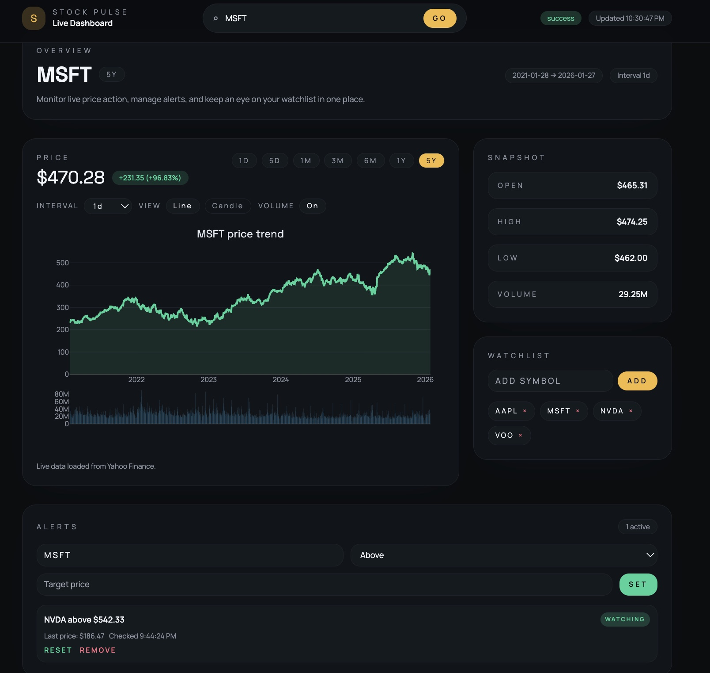

# Stock Data Visualization Dashboard

<a id="readme-top"></a>

<p align="center">
  <br>
  
  <br>
</p>

<h3 align="center">Stock Data Visualization Dashboard</h3>

<p align="center">
  A modern stock dashboard with live price charts, watchlists, and alerts.
  <br>
  <a href="https://github.com/17addisonlin/Stock-Data-Visualization-Dashboard"><strong>Explore the repo »</strong></a>
  <br>
  English
</p>

<p align="center">
  
  
  
  
  
  
</p>

<p align="center">
  <a href="https://github.com/17addisonlin/Stock-Data-Visualization-Dashboard">View Repo</a>
  &nbsp; | &nbsp;
  <a href="https://github.com/17addisonlin/Stock-Data-Visualization-Dashboard/issues/new?labels=bug">Report Bug</a>
  &nbsp; | &nbsp;
  <a href="https://github.com/17addisonlin/Stock-Data-Visualization-Dashboard/issues/new?labels=enhancement">Request Feature</a>
</p>

<details>
  <summary>Table of Contents</summary>
  <ol>
    <li>
      <a href="#about-the-project">About The Project</a>
      <ul>
        <li><a href="#built-with">Built With</a></li>
        <li><a href="#features">Features</a></li>
      </ul>
    </li>
    <li>
      <a href="#getting-started">Getting Started</a>
      <ul>
        <li><a href="#prerequisites">Prerequisites</a></li>
        <li><a href="#installation">Installation</a></li>
        <li><a href="#running-locally">Running Locally</a></li>
      </ul>
    </li>
    <li><a href="#usage">Usage</a></li>
    <li><a href="#troubleshooting">Troubleshooting</a></li>
    <li><a href="#roadmap">Roadmap</a></li>
    <li><a href="#contributing">Contributing</a></li>
    <li><a href="#license">License</a></li>
    <li><a href="#contact">Contact</a></li>
    <li><a href="#acknowledgments">Acknowledgments</a></li>
  </ol>
</details>

## About The Project



This project is a full‑stack stock dashboard that pulls time‑series data from Yahoo Finance, renders interactive charts with Plotly, and provides watchlist + alert tools. It is designed to be responsive, fast, and easy to extend with fundamentals or multi‑ticker comparisons.

<p align="right">(<a href="#readme-top">back to top</a>)</p>

### Built With

* [![React][React-badge]][React-url]
* [![Vite][Vite-badge]][Vite-url]
* [![Tailwind][Tailwind-badge]][Tailwind-url]
* [![Plotly][Plotly-badge]][Plotly-url]
* [![Node][Node-badge]][Node-url]
* [![Express][Express-badge]][Express-url]

<p align="right">(<a href="#readme-top">back to top</a>)</p>

### Features

- Ticker search with live price updates
- Line or candlestick charts with volume overlay
- Date range + interval controls
- Watchlist with saved tickers (localStorage)
- Price alerts with status tracking
- Dark, finance‑style UI

<p align="right">(<a href="#readme-top">back to top</a>)</p>

## Getting Started

### Prerequisites

- Node.js 18+
- npm (ships with Node.js)

### Installation

1. Clone the repo
   ```sh
   git clone https://github.com/17addisonlin/Stock-Data-Visualization-Dashboard.git
   ```
2. Install server dependencies
   ```sh
   npm install
   ```
3. Install client dependencies
   ```sh
   cd client
   npm install
   ```

### Running Locally

1. Start the API server
   ```sh
   npm start
   ```
2. Start the client in a second terminal
   ```sh
   cd client
   npm run dev
   ```
3. Open the Vite URL (usually `http://localhost:5173`). The API runs on `http://localhost:5050`.

<p align="right">(<a href="#readme-top">back to top</a>)</p>

## Usage

1. Search for a ticker (e.g., TSLA, AAPL, NVDA).
2. Use the range pills and interval selector to adjust the chart.
3. Toggle line/candlestick view and volume overlay.
4. Add tickers to the watchlist for fast switching.
5. Create alerts to track price thresholds.

<p align="right">(<a href="#readme-top">back to top</a>)</p>

## Troubleshooting

- **403 on `http://localhost:5000`:** macOS AirPlay can reserve port 5000. This project defaults to port **5050**.
- **No data returned:** the symbol may be invalid or data may be missing for the chosen range/interval.
- **Chart not updating:** confirm both the server and client are running.

<p align="right">(<a href="#readme-top">back to top</a>)</p>

## Roadmap

- [ ] Fundamentals + company profile data
- [ ] Multi‑ticker comparison view
- [ ] Authentication + cloud‑saved preferences
- [ ] Server caching & rate‑limit handling
- [ ] Deployment guide

<p align="right">(<a href="#readme-top">back to top</a>)</p>

## Contributing

Contributions are welcome. Please open an issue or submit a pull request.

1. Fork the Project
2. Create your Feature Branch (`git checkout -b feature/AmazingFeature`)
3. Commit your Changes (`git commit -m 'Add some AmazingFeature'`)
4. Push to the Branch (`git push origin feature/AmazingFeature`)
5. Open a Pull Request

<p align="right">(<a href="#readme-top">back to top</a>)</p>

## License

Distributed under the MIT License. See `LICENSE` for more information.

<p align="right">(<a href="#readme-top">back to top</a>)</p>

## Contact

Addison Lin - [LinkedIn](https://www.linkedin.com/in/addison-lin-227002274/)

Project Link: [https://github.com/17addisonlin/Stock-Data-Visualization-Dashboard](https://github.com/17addisonlin/Stock-Data-Visualization-Dashboard)

<p align="right">(<a href="#readme-top">back to top</a>)</p>

## Acknowledgments

* [Yahoo Finance](https://finance.yahoo.com/)
* [Plotly](https://plotly.com/javascript/)
* [Tailwind CSS](https://tailwindcss.com/)
* [Dribbble UI Credit Michael Wang](https://dribbble.com/wangmander)

<p align="right">(<a href="#readme-top">back to top</a>)</p>

<!-- MARKDOWN LINKS & IMAGES -->
[React-badge]: https://img.shields.io/badge/React-61dafb?style=for-the-badge&logo=react&logoColor=white
[React-url]: https://react.dev/
[Vite-badge]: https://img.shields.io/badge/Vite-646cff?style=for-the-badge&logo=vite&logoColor=white
[Vite-url]: https://vitejs.dev/
[Tailwind-badge]: https://img.shields.io/badge/TailwindCSS-0ea5e9?style=for-the-badge&logo=tailwindcss&logoColor=white
[Tailwind-url]: https://tailwindcss.com/
[Plotly-badge]: https://img.shields.io/badge/Plotly-3f4f75?style=for-the-badge&logo=plotly&logoColor=white
[Plotly-url]: https://plotly.com/javascript/
[Node-badge]: https://img.shields.io/badge/node.js-339933?style=for-the-badge&logo=node.js&logoColor=white
[Node-url]: https://nodejs.org/
[Express-badge]: https://img.shields.io/badge/Express-444444?style=for-the-badge&logo=express&logoColor=white
[Express-url]: https://expressjs.com/
